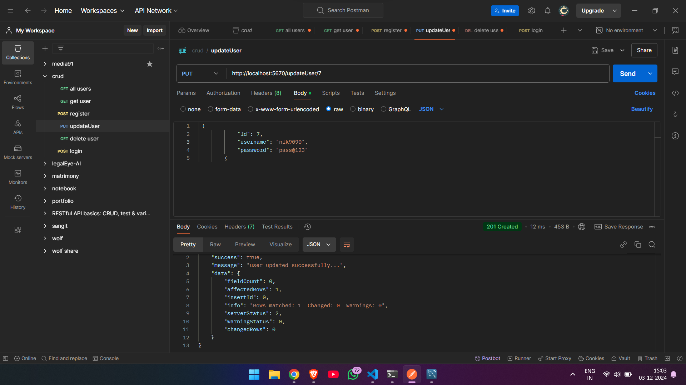
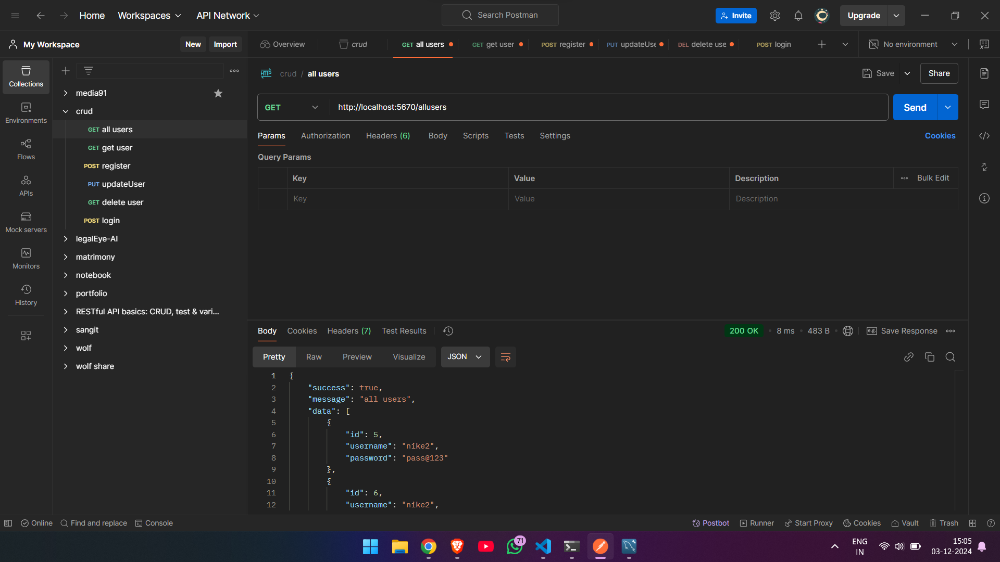
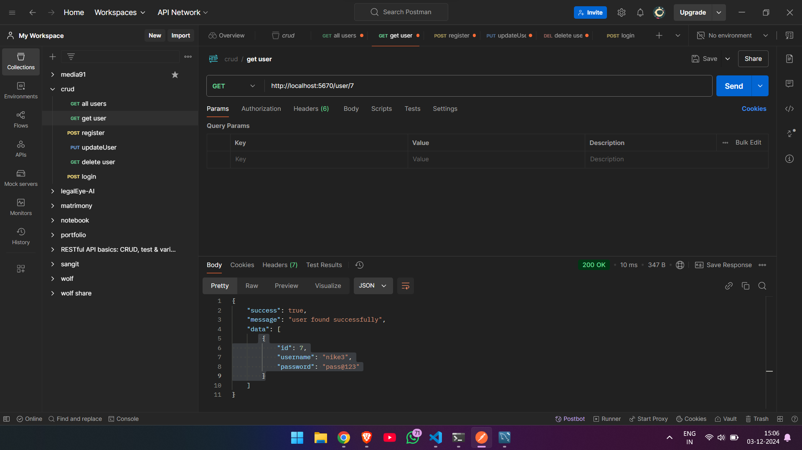
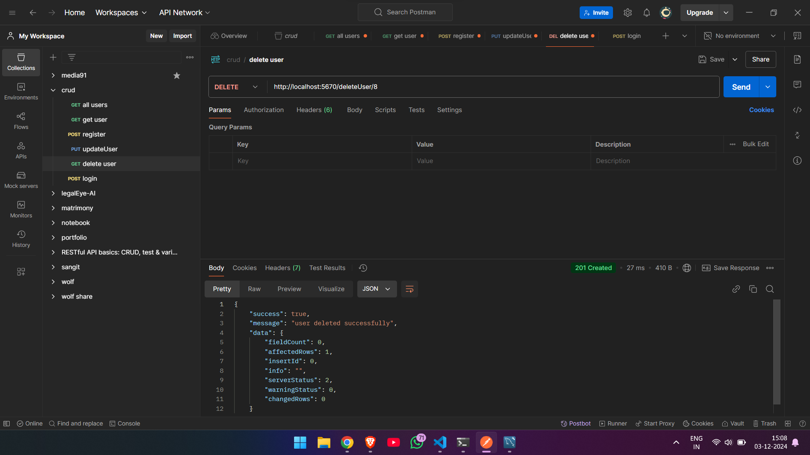

# crud api using node js , express js and mysql

here we using node js express js and mysql for creating crud api

## .env file

```
PORT = 5670
MYSQL_PASS = your pass
MYSQL_DB = your db name
```

## routes

update

```
 http://localhost:5670/updateUser/id
```

all users

```
 http://localhost:5670/allusers
```

get user by id

```
http://localhost:5670/user/id
```

register

```
http://localhost:5670/register
```

login

```
http://localhost:5670/login
```

delete

```
http://localhost:5670/deleteUser/id
```

## update



## allusers



## get user



## register


## deleteuser


